Book Images
===========

These are the images I created as I worked through the Ray Tracing in a Weekend book.

---

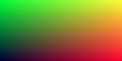

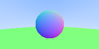

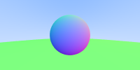

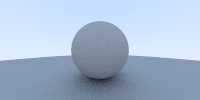

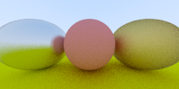

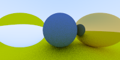

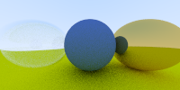

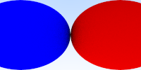

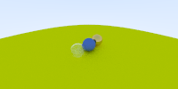

---

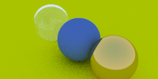

This image does not match the book as I'm having a hell of a time 
getting defocus blur working.  Not sure what is wrong, but I'm going to 
try to just generate the final picture and see if that works.  I've noticed 
the book has a tendency to leave some (key ?) parts out.  So maybe I'm not 
actually incorrect?

---

I clearly have a couple of bugs.  First of all, my defocus blur clearly
_not_ working and I have a super grainy look.  

---

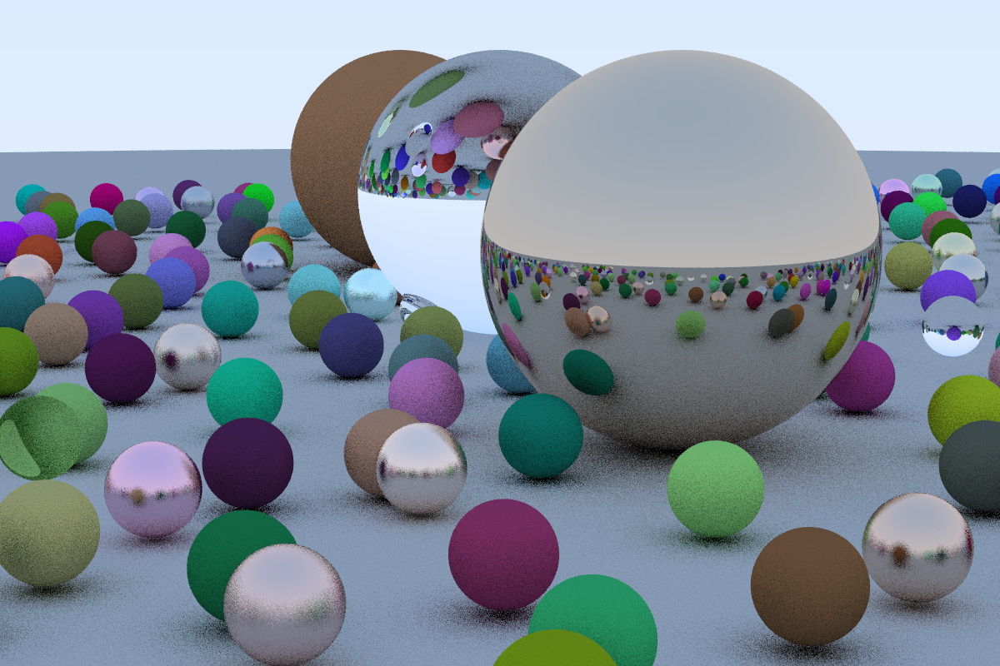

In attempting to debug my image I made the glass 100% refractive and that removed
the speckles from the sky so that helps narrow it down.

I'll also comment that this is one thing that this ray tracer does different from 
SW one I built before.  In the SW one every time a single ray hit a transparent object
it would shoot off two rays, for this ray tracer it just uses the fact that
the anti-aliasing is sending in multiple samples and just randomly selects either
refract or reflect.  It's an interesting difference.

---

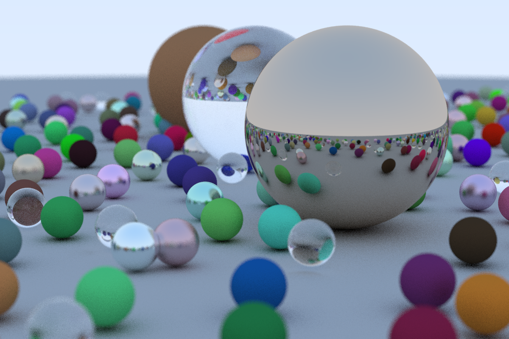

I finally figured out the bug with defocus blur not working, it was due to an accidental
':' that was scoping a variable ... doesn't really matter.  What does matter is that it now
works!  And I also figured out why the images looked so grainy, I just wasn't sampling enough.
This is where I think the book doesn't do the best job explaining these things, anyhow,
the following image is with the aperture set to 0.1

---

and now with the aperture it to 1.0.

---

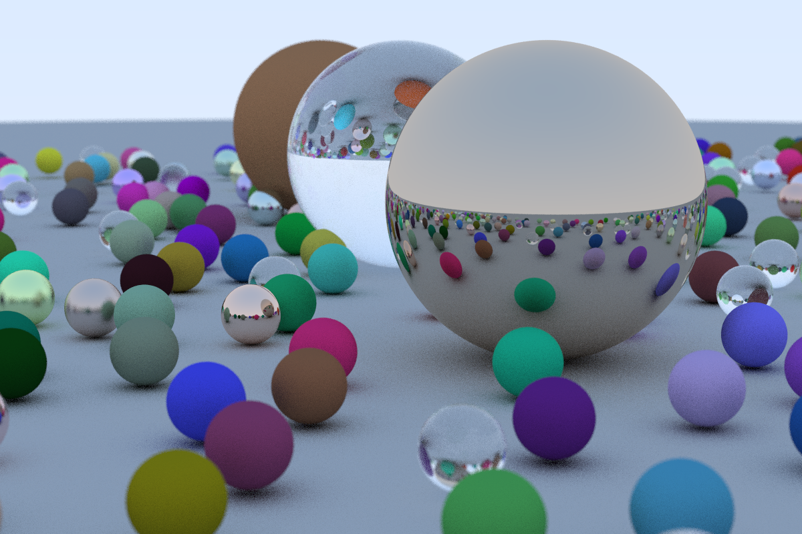

and finally to 0.05 ... I sort of like this image the best.

---

This phase of the project is complete.