More Images
===========

This is just a set of additional images I've generated as I continue to develop the ray
tracer.  I have a set of additional things I want to explore before I'm done with this 
project and move onto my next.

Initial
---

This is the one image I created in my sodaWater ray tracer before I abandoned that
effort and started working with the Ray Tracer in a Weekend book.  It's a block, but
my lighting was all messed up.

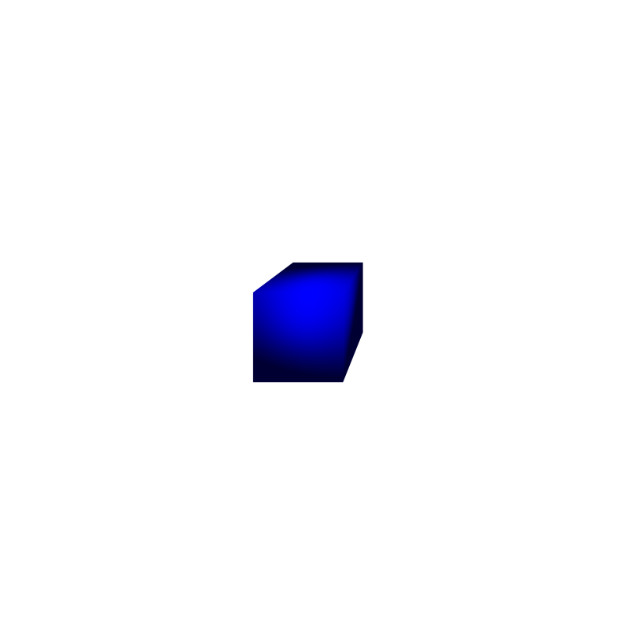

Blocks
---

However, I was able to take the code for rendering blocks from the other ray tracer
and mostly copy it directly into my weekend project.  Thankfully I still remembered 
the basic algorithm for how to do this from when I took the 3d graphics class in 
graduate school.  I really like how the blocks look in this scene.

---

All of the other images use a huge sphere to represent the ground, but for this I 
thought I would replace it with a real block and I made it metallic as well.  
I really like this picture, but I do miss the shadows which don't render as well
 on metal.

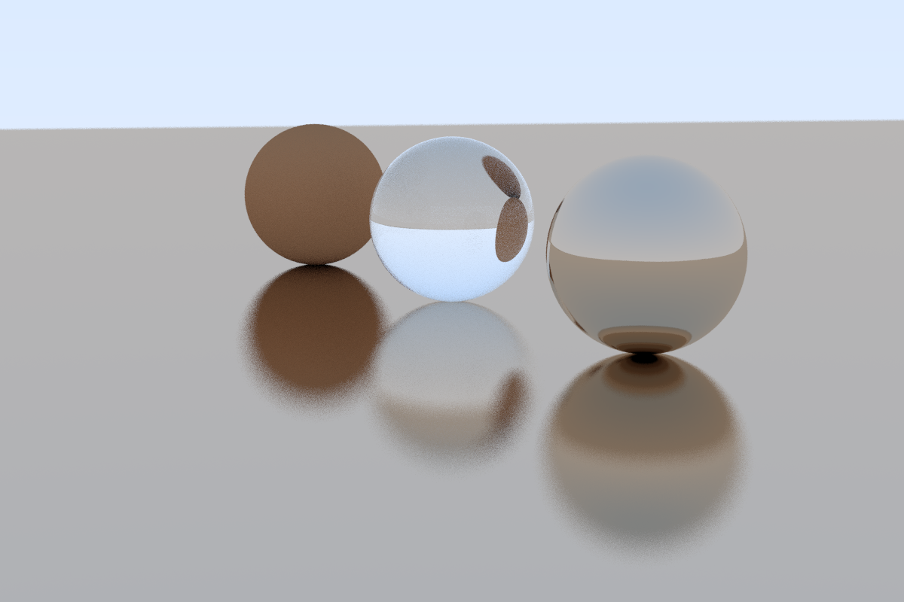

---

Just a big image with blocks and using a big block as the ground.  I don't love this
image, but I am using it as a test to see if running multiple goroutines can speed
up the render.  This image was generated with 50 goroutines and took 455m to finish.

---

As I was explaining to someone how rendering a block works, it occurred to me that
it should be easy to detect the edges of a block and outline them in black.  This was
my first attempt to test it out and it worked really well.  I don't think I'll keep
it on as a default, but it was pretty cool.

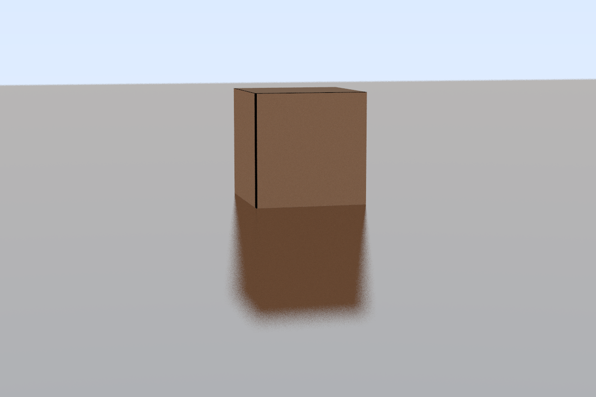

---

A bigger image with more blocks and black edges. I don't care for this image and I
think I'm done with the black edges.

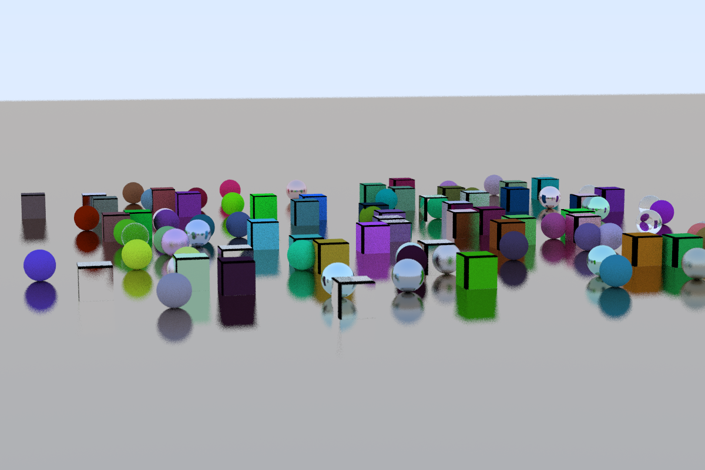

--- 

Okay, one more, still nope.

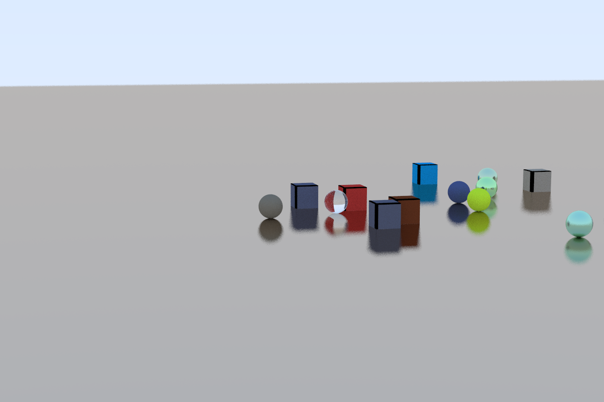

Colored
---

Next up, coloring the glass.  (Okay, technically not glass, but you get what I mean)

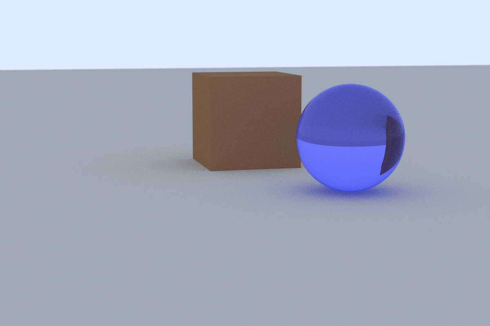

---

Add a red sphere in as well.  Refraction index on red sphere = 2.5

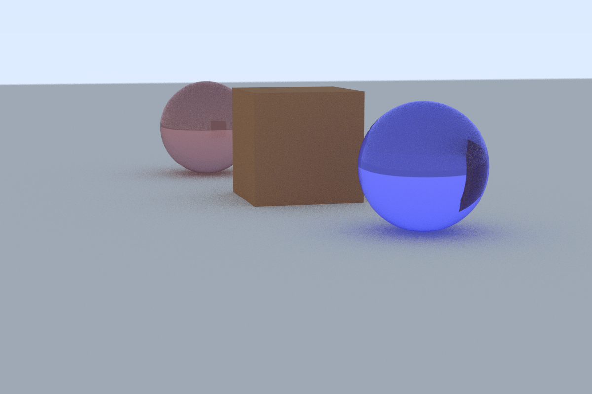

---

Refraction index on red sphere = 1.1

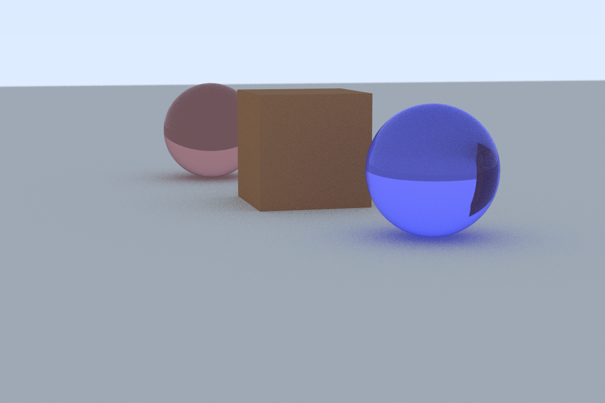

Rotation
---

Rotating the cube around the y axis by 45 radians.  (This was suppose to be 45 degrees
but I forgot to convert degrees to radians).

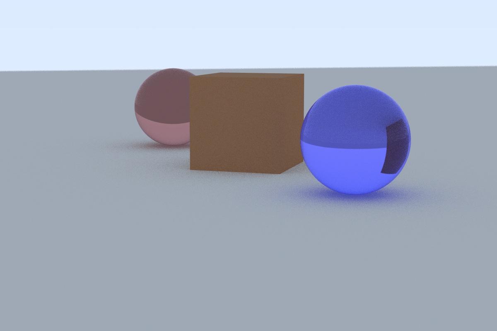

---

Now a true 45 degree rotation around the y axis.

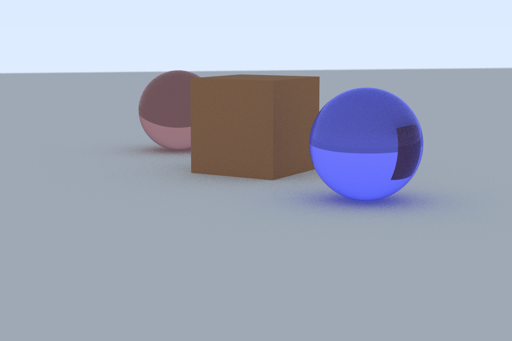

---

Finally, 10 degrees around the x axis and then 10 degrees around the y. 

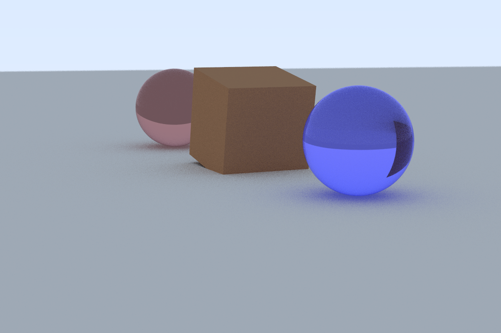

Implementing a z rotation would be likewise easy so I think I'm going to stop here
and move on to lights and shadows.