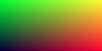
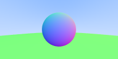
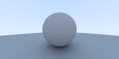
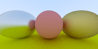
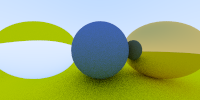
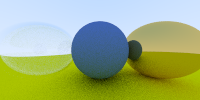
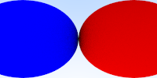
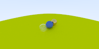
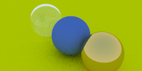
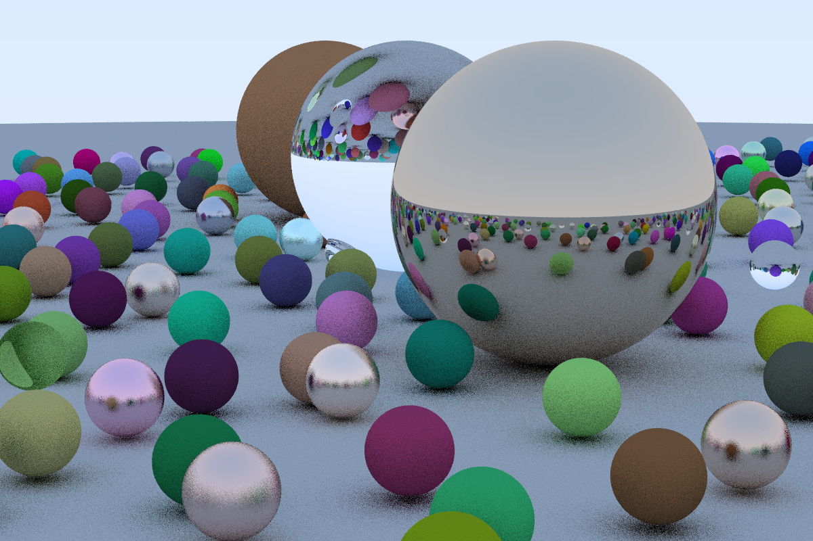

This next image does not match the book as I'm having a hell of a time 
getting defocus blur working.  Not sure what is wrong, but I'm going to 
try to just generate the final picture and see if that works.  I've noticed 
the book has a tendency to leave some (key ?) parts out.  So maybe I'm not 
actually incorrect?

I clearly have a couple of bugs.  First of all, my defocus blur clearly
_not_ working and I have a super grainy look.  

In attempting to debug my image I made the glass 100% refractive and that removed
the speckles from the sky so that helps narrow it down.

I'll also comment that this is one thing that this ray tracer does different from 
SW one I built before.  In the SW one every time a single ray hit a transparent object
it would shoot off two rays, for this ray tracer it just uses the fact that
the anti-aliasing is sending in multiple samples and just randomly selects either
refract or reflect.  It's an interesting difference.

